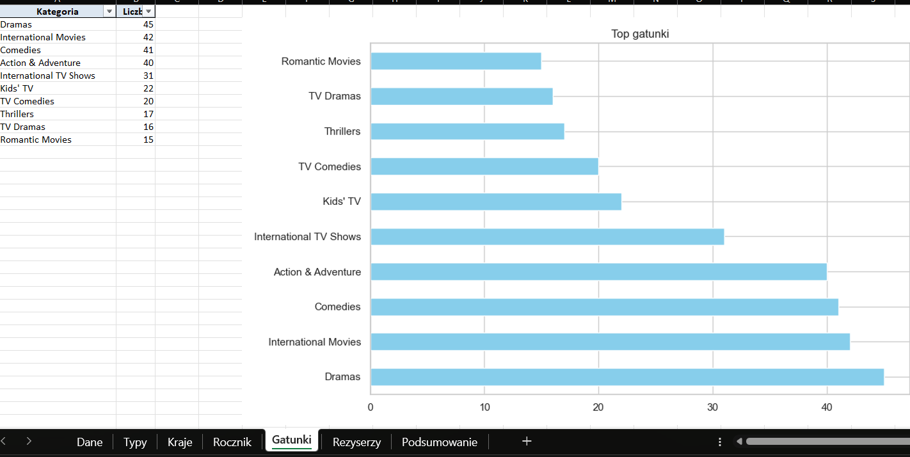
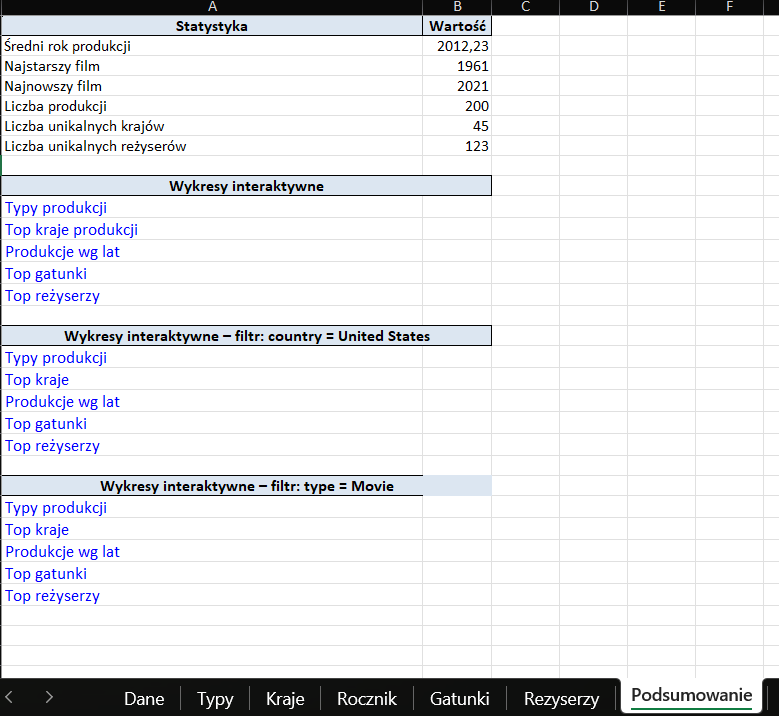
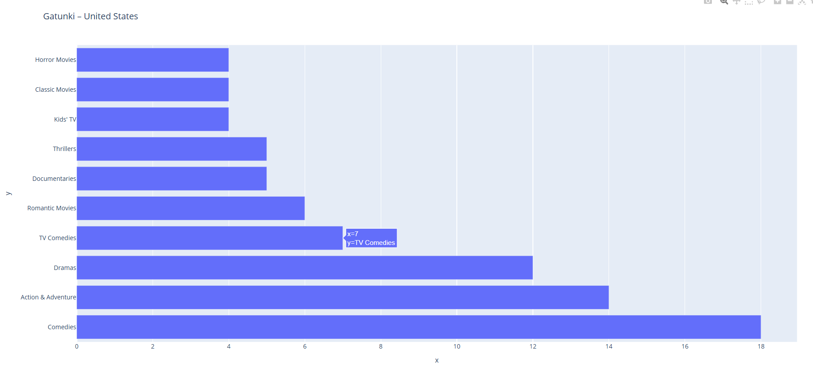
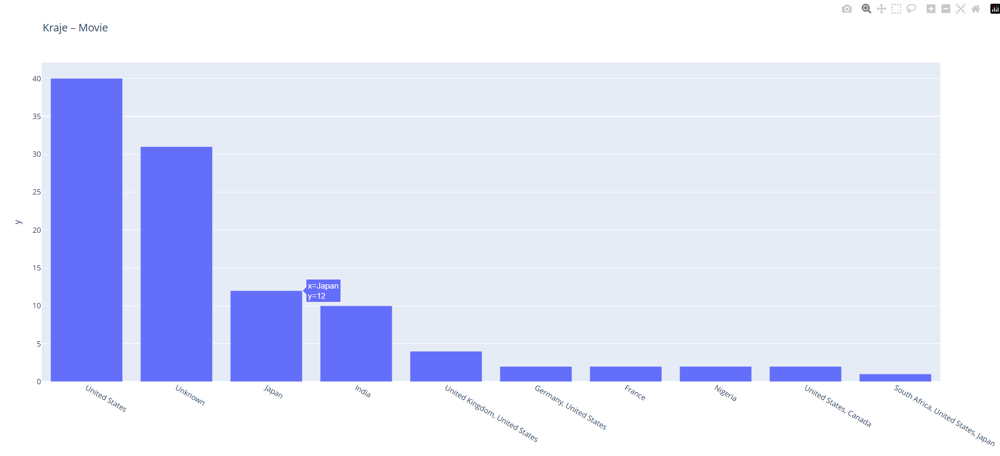

<h1>Analiza danych Netflixa</h1>

Projekt oparty na Pythonie i bibliotekach <b>pandas</b>, <b>openpyxl</b>, <b>matplotlib</b>, <b>seaborn</b> oraz <b>plotly</b>. 
Automatyczny generator raportu z danych Netflixa zawierający statystyki, wykresy oraz interaktywne wizualizacje. 
Skrypt tworzy raport Excel (<b>dane/analiza_netflix.xlsx</b>) z przetworzonymi danymi, wykresami i hiperlinkami do wersji interaktywnych. 

<h2>Funkcje</h2>

- Analiza danych z pliku <code>netflix.csv</code>
- Czyszczenie danych i konwersja dat (bez godzin)
- Obliczanie statystyk:
  - Typy produkcji (film/serial)
  - Najczęstsze kraje
  - Gatunki (zliczane ze złożonych tagów)
  - Reżyserzy
  - Rozkład według lat
- Eksport do Excela z:
  - Arkuszem danych źródłowych
  - Osobnymi arkuszami z topowymi kategoriami i wykresami
  - Statycznymi wykresami (PNG)
  - Interaktywnymi wykresami (HTML) z linkami w Excelu
  - Arkuszem <b>Podsumowanie</b> z metadanymi i hiperlinkami

<h3>Arkusz: Gatunki</h3>

<h3>Arkusz: Podsumowanie</h3>

<h3>Wykres interaktywny: Gatunki dla kraju United States</h3>

<h3>Wykres interaktywny: Kraje dla typu produkcji Movies </h3>

